# Dual-Engine Financial Intelligence Platform

An end-to-end, production-grade **MLOps & LLMOps** platform featuring an integrated AI architecture. The system unifies a fine-tuned local Transformer model for real-time risk classification with a Generative AI Retrieval-Augmented Generation (RAG) pipeline, backed by automated **CI/CD** infrastructure for seamless verification and deployment.

---

## 🏗️ Architecture Overview

The platform integrates two high-performance operational phases exposed via a single, unified containerized FastAPI backend and a decoupled Streamlit frontend dashboard:

### Phase 1: Real-Time Financial Sentiment Engine
* **Core Model:** Fine-tuned `bert-base-uncased` via Hugging Face and PyTorch.
* **Training & Compute:** Trained using a **Google Colab T4 GPU** environment. The optimized model weights (`model.pt`) were exported and packed into our local production inference layer.
* **Objective:** Analyzes volatile financial text statements and provides instantaneous sentiment classification (`Positive`, `Negative`, `Neutral`) locally, ensuring ultra-low latency without external network dependencies.

#### 📊 Model Training Metrics (2 Epochs)
| Epoch | Training Loss | Validation Loss | Accuracy |
| :--- | :--- | :--- | :--- |
| **Epoch 1** | 0.6917 |  0.4621  | 82.15% |
| **Epoch 2** | 0.3462 | 0.4151 | 84.30% | 

### Phase 2: Grounded Financial Q&A (GenAI RAG Engine)
* **Orchestration:** LangChain Framework.
* **Vector Storage:** Qdrant Vector Database (isolated container for high-speed dense vector similarity searches).
* **LLM Engine:** Google Gemini Pro (`gemini-1.5-flash`) via `langchain-google-genai`.
* **Objective:** Prevents hallucinations by forcing the LLM to synthesize answers grounded strictly inside extracted financial document contexts retrieved via vector similarity search.

### 🖥️ Unified Front-End Interface
Both engines are accessible side-by-side inside a responsive, real-time analytics dashboard.

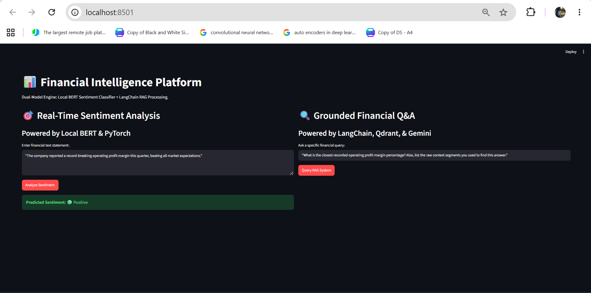

---

## 🛠️ Enterprise MLOps Features & Infrastructure

### 1. Multi-Container Orchestration (Docker)
The entire ecosystem is containerized and orchestrated using **Docker Compose**. This isolates the FastAPI core engine, the Qdrant database, and the MLflow instance into a shared local network.
* FastAPI routes local traffic and hosts both AI engines seamlessly on port **8001**.

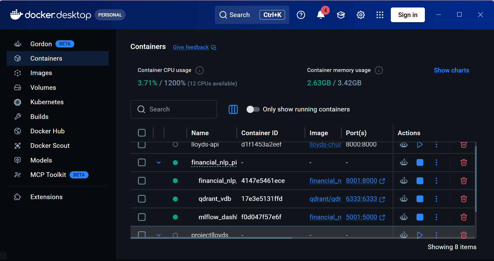

### 2. Interactive Swagger API Gateway & Verification
The FastAPI application provides a single entry point exposing endpoints for both real-time model inference (`/predict`) and conversational retrieval (`/rag`).

#### 🔹 Phase 1 Engine: BERT Sentiment Analyzer (`/predict`)

| API Input Payload (Text String) | Backend API JSON Response |
| :---: | :---: |
| 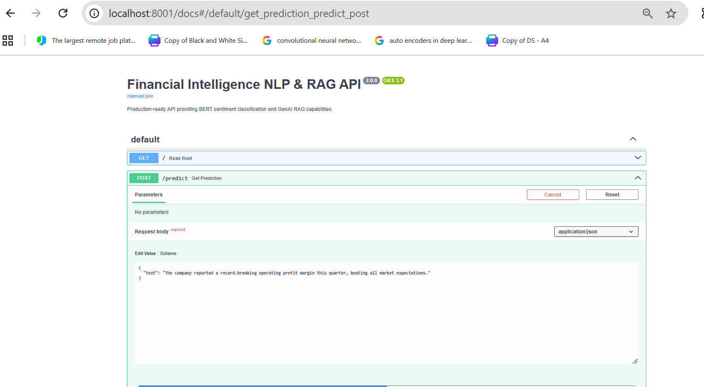 | 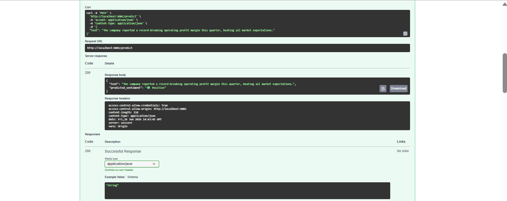 |

#### 🔹 Phase 2 Engine: LangChain GenAI (`/rag`)

| API Input Payload (Financial Query) | Grounded Context JSON Response |
| :---: | :---: |
| 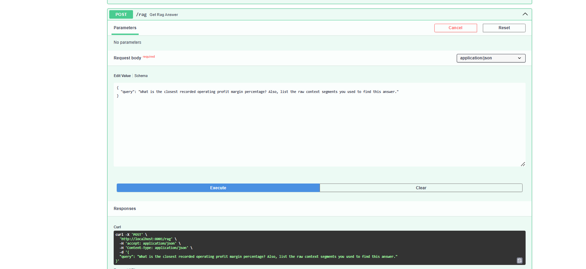 | 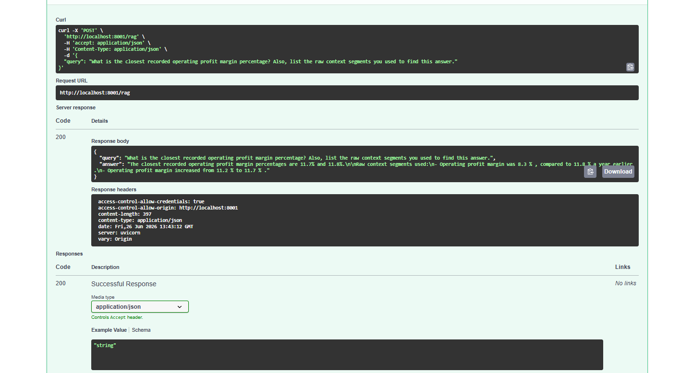 |

---

### 3. Vector Store Verification (Qdrant Database)
Tracks collections, payload parameters, and structural vector payloads directly within an isolated vector environment.

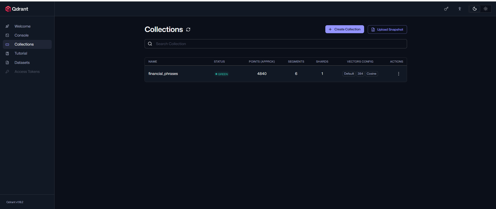

---

### 4. Automated CI/CD Pipeline (GitHub Actions)
Structured via **GitHub Actions**. Every code push triggers automated dependency builds, linting validation, and an automated integration test suite (`test_api.py`) to guarantee 100% uptime before deployment.

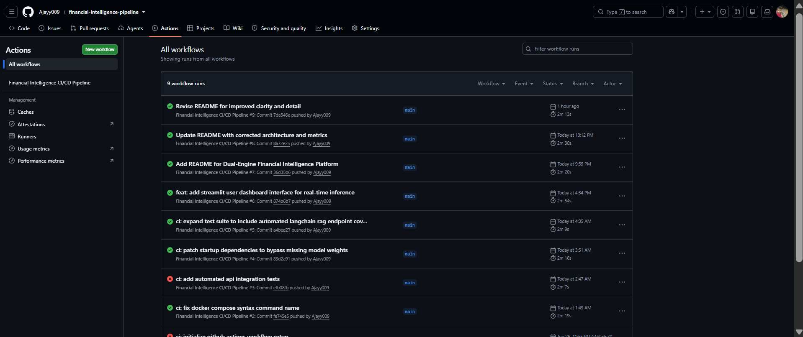

---

## 📈 Experiment Tracking & Observability (MLflow)

To maintain true production-tier reliability, we integrated an active tracking layer using **MLflow**. The system tracks training historical indicators alongside functional API operational states simultaneously:

| Run Configuration Hyperparameters | Logged Performance Metrics Curves |
| :---: | :---: |
| 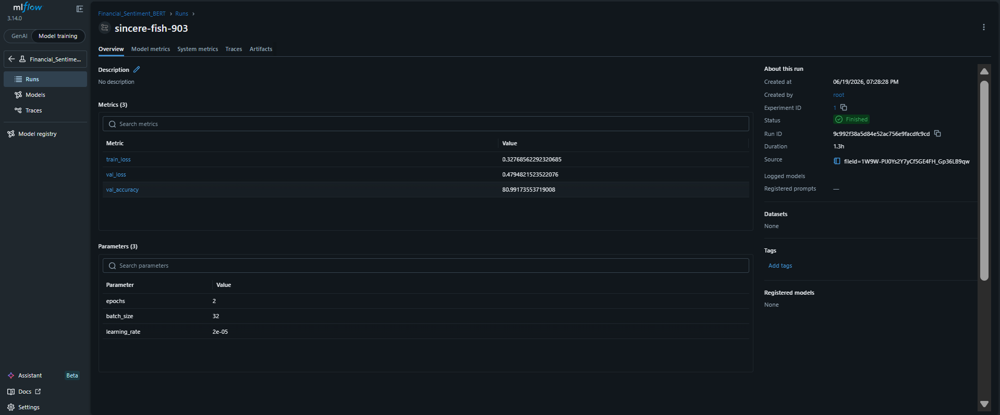 | 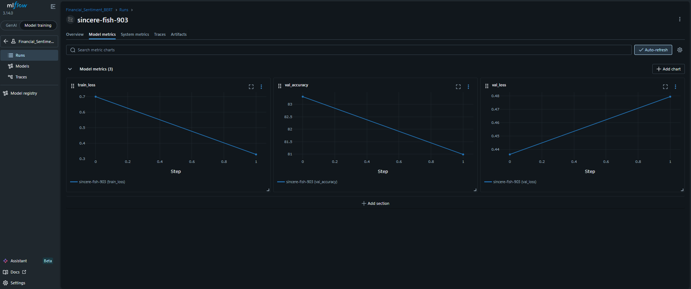 |

*System runtime dependencies, traces, and metadata parameters for GenAI components are fully isolated and monitored via target runtime identifiers:*

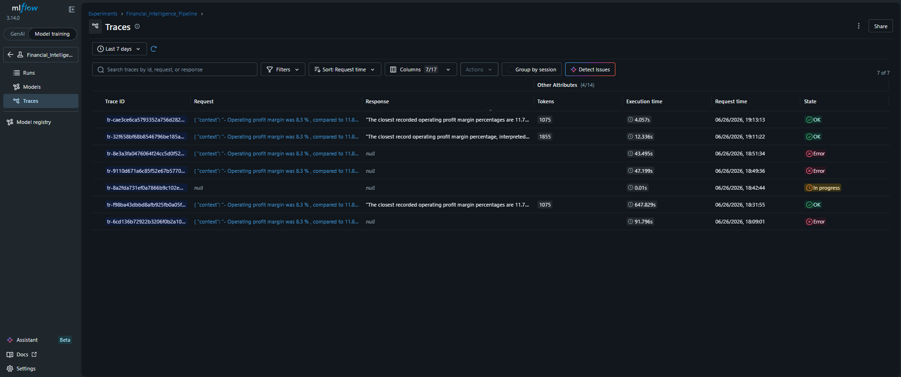

---

## 📁 Repository Structure

```text
FINANCIAL_NLP_PIPELINE/
├── .github/workflows/   # CI/CD GitHub Actions pipelines
├── src/
│   ├── rag/             # LangChain & Qdrant vector store logic
│   ├── main.py          # FastAPI application & API endpoints
│   ├── model.py         # PyTorch BERT network definition
│   ├── predict.py       # BERT inference pipeline logic
│   └── train.py         # Transformer model training script
├── app.py               # Streamlit Frontend User Dashboard
├── test_api.py          # Automated CI/CD backend integration tests
├── Dockerfile           # Backend engine image blueprint
├── docker-compose.yml   # Multi-container orchestration specification
├── requirements.txt     # Python project dependencies
└── README.md            # System documentation
